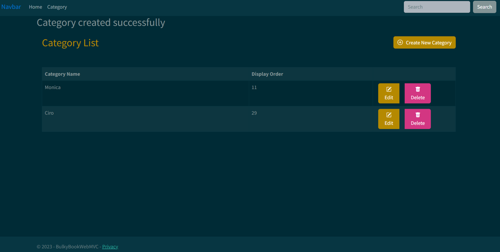

## Description
BulkyBookMVC is a CRUD application with MVC built using ASP.NET Core, Entity Framework Core, SQL Server Management Studio, and set up for future deployment to Azure.




## Table of Contents
  - [Description](#description)
  - [Table of Contents](#table-of-contents)
  - [Technologies Used For this Application](#technologies-used-for-this-application)
  - [References](#references)


## Technologies Used For this Application
---
```md
* C#
* ASP.NET CORE
* Entity Framework Core
* SQL Server Management Studio
* Bootstrap
* Bootswatch 
* Azure Deployment
```


## References
---
Course developed by: <a href= "https://www.youtube.com/watch?app=desktop&v=hZ1DASYd9rk&feature=youtu.be">Bhrugen Patel</a>

Application GitHub URL : <a href= "https://github.com/monicadolce/BullyBookMVC">Visit Monica's GitHub Repository</a> 
